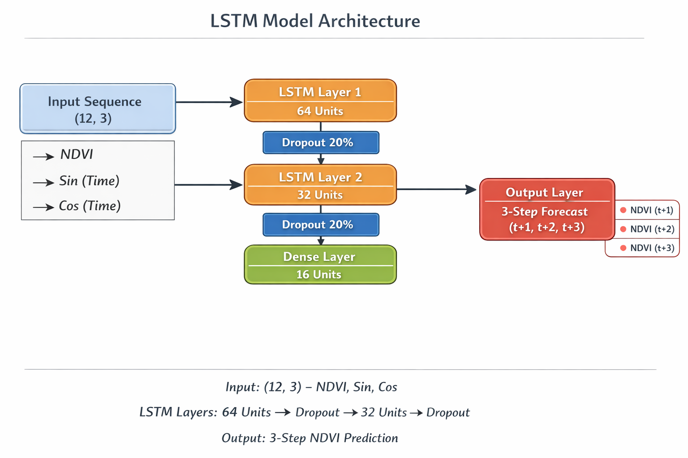

# Wildfire Anomaly Detection Using Normalized Difference Vegetation Index (NDVI) Time-Series Derived from Sentinel-2 Imagery and Long Short-Term Memory (LSTM)

This project uses NDVI time-series extracted directly from Sentinel-2 imagery via the Google Earth Engine (GEE) platform, without downloading raw imagery locally. Biweekly NDVI composites are computed over a defined area of interest and fed into an LSTM deep learning model for forecasting and anomaly scoring, enabling early warning of vegetation stress and potential wildfire-related disturbances. An interactive dashboard for exploring NDVI trends, anomalies, and alerts is also developed and will be shared separately.

---

## Data Sources

- Sentinel-2 Surface Reflectance Harmonized (COPERNICUS/S2_SR_HARMONIZED)  
  Used to compute NDVI from NIR (B8) and Red (B4) reflectance bands. Images are filtered by cloud cover and masked using QA60 and SCL quality layers.

- Temporal Configuration  
  - Start Date: 2018-01-01  
  - End Date: 2025-12-31  
  - Cloud Threshold: 20%

- Area of Interest  
  Bounding-box AOI defined in project configuration and converted to a Google Earth Engine geometry.

---

## Processing Steps

1. Data Access and Initialization  
   Initialize Google Earth Engine and load project configuration for AOI, date range, and cloud threshold.

2. Sentinel-2 Filtering and Cloud Masking  
   Filter the Sentinel-2 collection by AOI, date range, and cloud cover; apply QA60 and scene-class masks to reduce cloud and shadow contamination.

3. Biweekly NDVI Time-Series Extraction  
   Build 14-day intervals, compute median composites, derive NDVI, and reduce each interval to a representative NDVI statistic over the AOI.

4. Statistical Review  
   Summarize NDVI distribution, count valid observations, and inspect temporal behavior across the monitoring period.

5. Monthly NDVI Animation  
   Generate monthly NDVI map frames with quality thresholds for observation count and valid pixel coverage, then export a GIF animation for visual interpretation.

6. LSTM-Based Forecasting and Anomaly Scoring  
   Train and apply an LSTM workflow on NDVI sequences, generate anomaly scores, and compare against seasonal baselines.

     
   *LSTM model architecture used for NDVI sequence forecasting and anomaly scoring.*

7. Near Real-Time Alert Generation  
   Produce short-horizon forecasts and trigger alert payloads based on score thresholds and seasonal drop rules, with optional webhook and email notification support.

---

## Exports

| Export Name | Type | Description |
|-------------|------|-------------|
| ndvi_timeseries.csv | CSV | Biweekly NDVI values for analysis and model training |
| ndvi_values.npy | NPY | Clean NDVI numeric array for model input |
| ndvi_hq.gif | GIF | Monthly NDVI animation over AOI |
| anomaly_detection_results_seasonal.csv | CSV | Seasonal anomaly scoring results |
| near_realtime_forecast.csv | CSV | Short-horizon NDVI forecast output |
| latest_alert_payload.json | JSON | Latest alert payload for automation/webhooks |
| latest_alerts.csv | CSV | Latest alert summary table |

---

## How to Run

1. Create and activate the environment from the environment specification.
2. Install project dependencies.
3. Configure Google Earth Engine authentication and project ID.
4. Verify AOI and date parameters in config.
5. Run notebooks in sequence:
   - `01_data_collection_gee.ipynb` 
   - `02_ndvi_calculation.ipynb` 
   - `03_lstm_training_evaluation.ipynb`
   - `04_anomaly_detection.ipynb` 
   - `05_near_realtime_alerts.ipynb` 
6. Optionally run near real-time alert script for operational alert generation.
7. Launch the dashboard to inspect NDVI trends, forecasts, alerts, and map animation.

---

## Example Output

> **Note:** Black pixels in the animation represent areas with no valid data for that month, typically due to persistent cloud cover or insufficient valid observations after cloud masking.

  
Monthly NDVI animation generated from Sentinel-2 composites after cloud masking and quality screening.

---

## Notes

- This workflow is intended for regional monitoring and early warning support.
- NDVI anomalies should be interpreted with seasonal context and, where possible, validated with ancillary data (weather, fire reports, local observations).
- Quality thresholds (cloud cover, valid pixel ratio, minimum observation count) directly affect animation quality and anomaly sensitivity.
- Google Earth Engine access and project permissions are required before execution.

---

## Author

[@htamiminia](https://github.com/htamiminia)

---

## License

MIT License - you may use, modify, and distribute with attribution. See the LICENSE file for details.